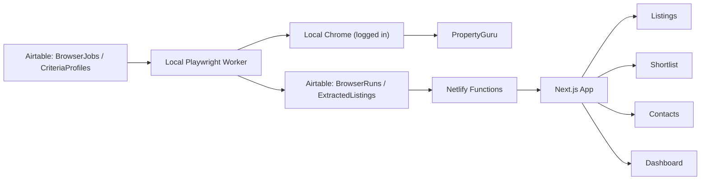
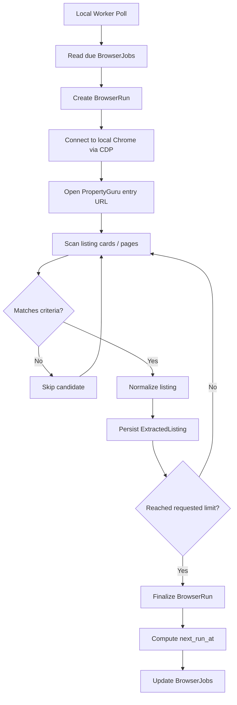

# Backend Flow Diagrams

## System Architecture

```mermaid
flowchart LR
    A["Airtable: BrowserJobs / CriteriaProfiles"] --> B["Local Playwright Worker"]
    B --> C["Local Chrome (logged in)"]
    C --> D["PropertyGuru"]
    B --> E["Airtable: BrowserRuns / ExtractedListings"]
    E --> F["Netlify Functions"]
    F --> G["Next.js App"]
    G --> H["Listings"]
    G --> I["Shortlist"]
    G --> J["Contacts"]
    G --> K["Dashboard"]
```

## Scheduled Browser-Use Flow

```mermaid
flowchart TD
    A["Local Worker Poll"] --> B["Read due BrowserJobs"]
    B --> C["Create BrowserRun"]
    C --> D["Connect to local Chrome via CDP"]
    D --> E["Open PropertyGuru entry URL"]
    E --> F["Scan listing cards / pages"]
    F --> G{"Matches criteria?"}
    G -- "No" --> H["Skip candidate"]
    G -- "Yes" --> I["Normalize listing"]
    I --> J["Persist ExtractedListing"]
    J --> K{"Reached requested limit?"}
    K -- "No" --> F
    K -- "Yes" --> L["Finalize BrowserRun"]
    H --> F
    L --> M["Compute next_run_at"]
    M --> N["Update BrowserJobs"]
```
