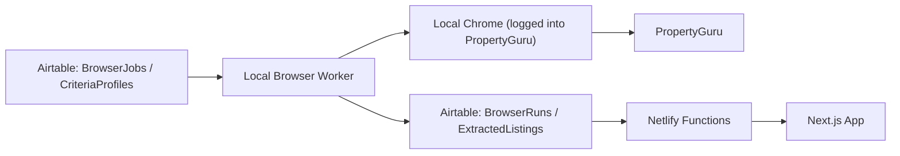
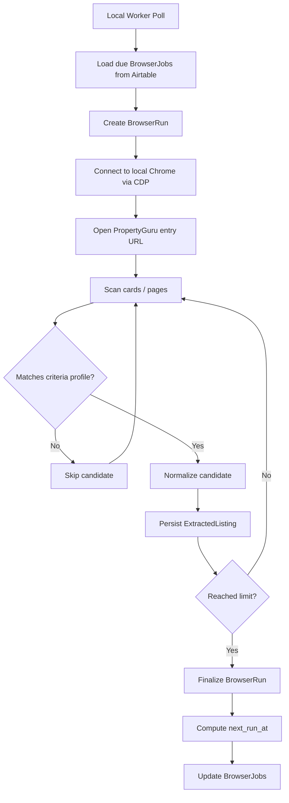

# Browser-Use MVP

## Goal

Run scheduled and on-demand PropertyGuru browser tasks against your authenticated local browser session, with Airtable acting as the control plane.

This MVP is intentionally narrower than the earlier ETL plan:

- no broad crawling
- no generic autonomous browser agent
- no attempt to run authenticated browsing inside Netlify
- no dependency on Firecrawl for the core extraction path

## System Shape



## Core Principle

The authenticated browser is the scarce resource.

That means:

- job definition belongs in Airtable
- execution belongs on the machine that owns the logged-in browser session
- retrieval for the app still belongs in Netlify

## Airtable Tables

### `CriteriaProfiles`

Defines reusable search criteria.

Recommended fields:

- `name`
- `enabled`
- `source_site`
- `max_price_sgd`
- `min_bedrooms`
- `min_sqft`
- `districts_json`
- `max_mrt_distance_m`
- `preferred_mrt_stations_json`
- `require_completed`
- `allowed_tenures_json`
- `max_drive_minutes_to_ips`
- `notes`

### `BrowserJobs`

Defines scheduled or manual browser tasks.

Recommended fields:

- `name`
- `enabled`
- `job_type`
- `entry_url`
- `criteria_profile_id`
- `limit`
- `max_pages`
- `sort_mode`
- `prompt`
- `schedule_kind`
- `schedule_value`
- `next_run_at`
- `last_run_at`
- `status`
- `last_error`
- `notes`

Recommended `job_type` values:

- `extract_matches`
- `refresh_listing`
- `navigate_and_capture`

Recommended `schedule_kind` values:

- `manual`
- `interval_minutes`
- `daily_time`

### `BrowserRuns`

Stores worker execution history.

Recommended fields:

- `run_id`
- `job_id`
- `started_at`
- `finished_at`
- `status`
- `matched_count`
- `scanned_count`
- `page_count`
- `error_summary`
- `screenshot_urls_json`
- `log_excerpt`

### `ExtractedListings`

Stores normalized extracted matches.

Recommended fields:

- `run_id`
- `job_id`
- `source_url`
- `source_listing_id`
- `project_name`
- `address`
- `district`
- `price_sgd`
- `bedrooms`
- `bathrooms`
- `size_sqft`
- `tenure`
- `top_year`
- `mrt_station`
- `mrt_distance_m`
- `matched_profile_id`
- `match_status`
- `agent_name`
- `agent_phone`
- `raw_card_json`
- `captured_at`

### `BrowserSettings`

Stores environment-level configuration.

Recommended fields:

- `chrome_cdp_url`
- `propertyguru_base_url`
- `default_timeout_ms`
- `poll_interval_seconds`
- `worker_enabled`

## Worker Contract

The local worker should not interpret arbitrary prompts as executable plans.

It should map Airtable rows to a strict contract.

```ts
type BrowserJobType =
  | "extract_matches"
  | "refresh_listing"
  | "navigate_and_capture";

type BrowserJob = {
  id: string;
  name: string;
  enabled: boolean;
  jobType: BrowserJobType;
  entryUrl: string;
  criteriaProfileId?: string;
  limit?: number;
  maxPages?: number;
  sortMode?: "price_low_to_high" | "newest" | "psf_low_to_high";
  prompt?: string;
  scheduleKind: "manual" | "interval_minutes" | "daily_time";
  scheduleValue?: string;
  nextRunAt?: string;
};
```

The `prompt` field is informational context, not the primary execution contract.

Example:

- `job_type = extract_matches`
- `entry_url = https://www.propertyguru.com.sg/...`
- `limit = 10`
- `criteria_profile_id = condo_mvp`
- `max_pages = 3`
- `prompt = extract 10 elements that fit our criteria`

## Execution Flow



## `extract_matches` Behavior

This should be the first and only implemented job type in v1.

Expected behavior:

1. Attach to Chrome over CDP.
2. Reuse the existing authenticated browser profile.
3. Navigate to `entry_url`.
4. Wait for listing cards to render.
5. Scan cards in visible order.
6. Parse fields needed for criteria evaluation.
7. Keep only cards matching the configured criteria profile.
8. Persist up to `limit` matches.
9. Stop early when the limit is reached.
10. Record the run outcome.

## Scheduler Logic

Do not depend on Airtable to execute jobs.

Use Airtable to store schedule intent. The local worker should compute whether a job is due.

Recommended logic:

- poll every 60 seconds
- select jobs where `enabled = true`
- run jobs where `next_run_at <= now`
- after success or failure, compute and write the next due time

This avoids mixing scheduling semantics into Airtable formulas or automations.

## Local Browser Requirements

The worker expects:

- Chrome running locally
- remote debugging enabled
- PropertyGuru login already completed by the user

Example Chrome launch shape:

```text
chrome --remote-debugging-port=9222 --user-data-dir=/path/to/profile
```

The worker should fail fast if:

- CDP is unavailable
- no browser context is present
- the session is logged out
- the listing cards do not render

## Failure Handling

Expected failure classes:

- Chrome not running
- CDP connection failure
- logged-out PropertyGuru session
- layout change on the search page
- Airtable API failure

For MVP, record failures in `BrowserRuns` and leave the job enabled unless the failure repeats beyond a simple threshold.

## Implementation Order

1. Airtable table definitions
2. local worker polling loop
3. Chrome CDP attachment
4. `extract_matches` runner
5. Airtable writes for `BrowserRuns` and `ExtractedListings`
6. schedule recalculation
7. Netlify read path for extracted listings

## Non-Goals For MVP

- generic agentic browsing
- arbitrary natural-language task planning
- full-site autonomous crawling
- remote authenticated browser execution
- replacing the existing frontend model
