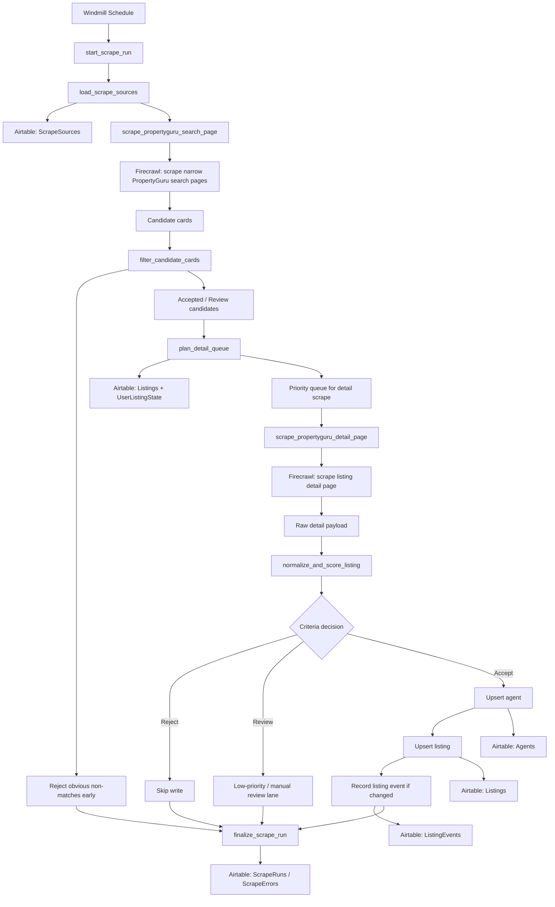

# Daily PropertyGuru Intake Flow

This flow is the first low-credit MVP ETL for PropertyGuru Singapore listings.

## Mermaid Diagram

## Intended step order

1. `start_scrape_run`
2. `load_scrape_sources`
3. `scrape_propertyguru_search_page`
4. `filter_candidate_cards`
5. `plan_detail_queue`
6. `scrape_propertyguru_detail_page`
7. `normalize_and_score_listing`
8. future Airtable upsert scripts
9. `finalize_scrape_run`

## Notes

- Discovery should only use narrow pre-filtered search URLs.
- Candidate cards should be rejected early on price, bedroom, size, district, and MRT criteria when available.
- Detail scrapes should be capped per run.
- Shortlisted listings should always outrank ordinary refresh work.
- Unchanged listings should not trigger unnecessary Airtable writes.

## Future scripts to add

- `upsert_agent`
- `upsert_listing`
- `record_listing_event`
- `record_scrape_error`
- `mark_stale_listings`
